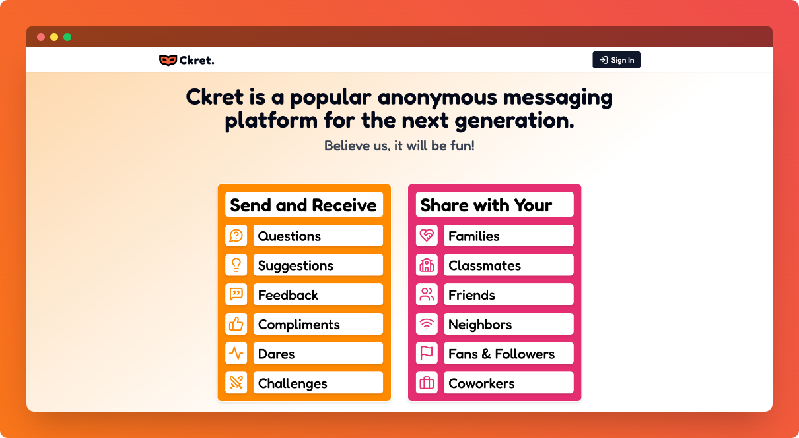

    

    <h1>Ckret</h1>
    
Anonymous Messaging Platform

    
    
    

 

## ⚡ Introduction

Ckret is an anonymous messaging platform, where users can send and receive messages anonymously via link.

## ✨ Features

- Exchange messages with friends and families anonymously.
- Create account anonymously or with gmail to get messages.
- Send secret messages using ckret link without even creating account.
- Share ckret link to social media platforms in one click to receive messages.
- Highly customizable settings for the best user experience.
- Install the Ckret App (PWA) for convenience.

## ⚙️ Tech Stack

- Next JS
- React JS
- Tailwind CSS
- Shadcn/ui
- Next Auth
- React Query

## 📦 Other Libraries and Tools

- Axios
- ES Lint
- Prettier
- React Lenis
- Lucide React
- React Hot Toast

## 🎯 Goals

- [x] Exploring `Next JS` and its core components such as App router, Caching, and SSR, while applying them in a project
- [x] Delving into `React Query`'s capabilities in managing asynchronous states effectively
- [x] Implement Google sign-in using `Next Auth` for enhanced user authentication and session management
- [x] Seamlessly integrating a `Next JS` web app with a dedicated backend service to manage data from the database
- [x] Embrace industry-standard development practices to refine skills and workflows

## 🖼️ Screenshots

## 👋🏻 Contact

